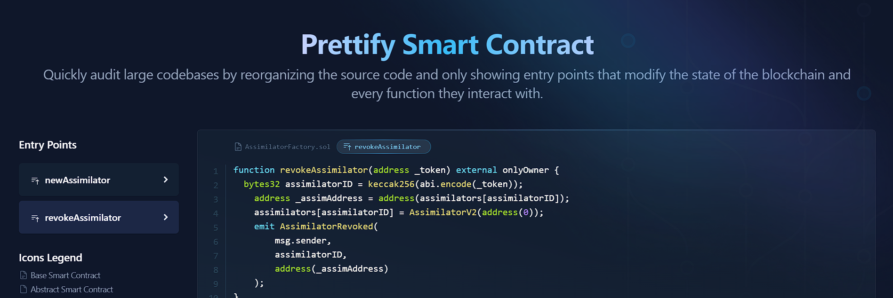
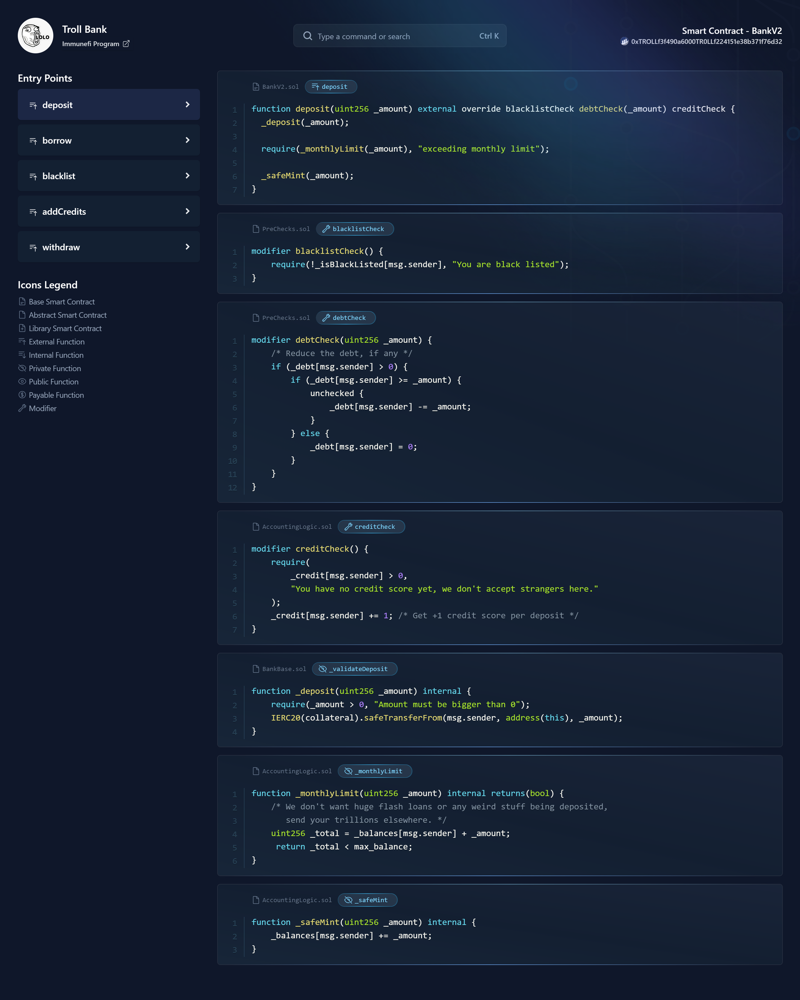
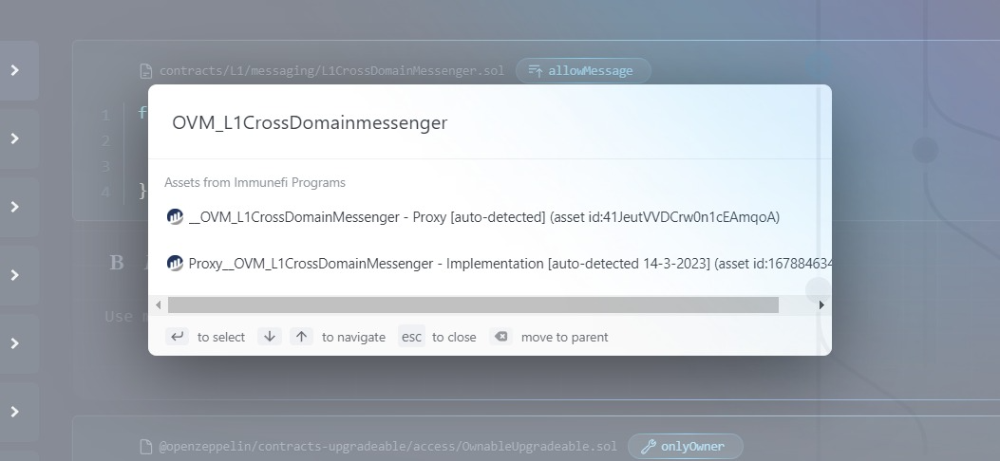
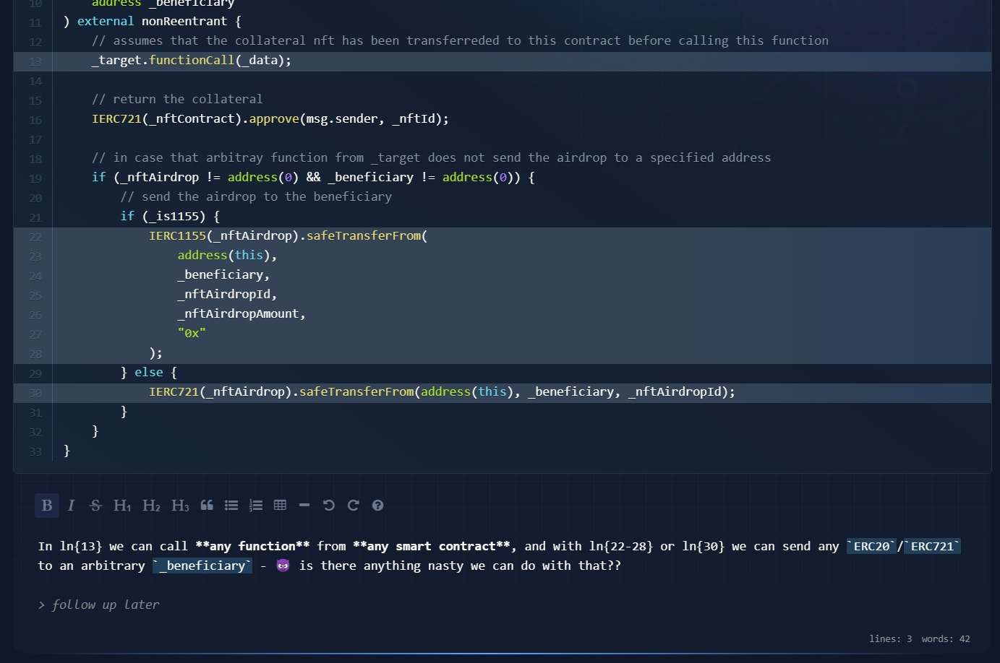

<p align="center">
  <a href="#%EF%B8%8F-what-problem-does-prettify-smart-contract-solve">What problem does it solve?</a> •
  <a href="#%EF%B8%8F-how-does-it-solve-it">How does it solve it?</a> •
  <a href="#-additional-features">Additional Features</a>
</p>

<hr>

# 🤷‍♂️ What problem does `Prettify Smart Contract` solve?

Modern smart contracts rely heavily on inheritance and libraries, spreading code everywhere.

This makes it difficult for security researchers to quickly and deeply understand a large code base - leading to auditors missing out many edge cases or even simple bugs.


## Simple example:
Try to audit the following `deposit(_amount)` function inside `BankV2.sol` smart contract:

```solidity
pragma solidity ^0.8.14;

import "./BankBase.sol";
import "./PreChecks.sol";
import "./AccountingLogic.sol";
import "./TransferLogic.sol";

contract BankV2 is BankBase, PreChecks, AccountingLogic, TransferLogic {
    constructor() {}

    function deposit(uint256 _amount) external override blacklistCheck debtCheck(_amount) creditCheck {
        _deposit(_amount);

        require(_monthlyLimit(_amount), "exceeding monthly limit");

        _safeMint(_amount);
    }

}
```

It calls `3 modifiers` and `3 internal functions` that are not defined inside `BankV2.sol` but in some of the `4 inherited smart contracts` (`BankBase.sol`, `PreChecks.sol`, `AccountingLogic.sol` and `TransferLogic.sol`) and each of these internal functions may call more internal/external functions, defined elsewhere, and those may use libraries, defined elsewhere.

Now, you will find yourself jumping from one smart contract to several others, back and forth. All that just to understand how the `deposit(_amount)` function works.


# 💁‍♂️ How does it solve it?

1. `Prettify Smart Contract` breaks apart any EVM address you give to him. All functions, modifiers, libraries, and parent contracts, line by line.

2. Build it again in a clean way that makes sense for security research - removing also `interfaces` and `code that is never used`.

3. Then, creates a dashboard in `http://localhost:8000/address/${smart_contract_address}/${chain}/` with 2 columns:

    - **[On the left]** are the **Entry Points** (external/public functions that modifiy the state of the blockchain) you can click any of them.
    
    - **[On the right]** the source code of the selected function, and all the modifiers and internal/external/public functions that are ever called when interacting with this entry point - no matter in what smart contract or library they are defined.

> EVERYTHING at a glance. Works like magic!


# ✨ Additional Features

### Command bar to search for
    - Immunefi Programs
    - HackenProof Programs
    - Code4rena Contests
    - Sherlock Contests
    - Etherscan, Bscscan, Arbiscan, Polygonscan, Ftmscan, Optimistic and Snowtrace addresses
    


### Proxy-compatible 
> Automatically detects if the address is a proxy, searches for the current implementation, and adds it to the scope of that Immunefi program (locally) if is not explicitly listed in the program's policy


### Add notes + highlight lines of code
> Works with all functions and modifiers

    
### Read the full smart contract
> In case you need to go "classic auditing mode" for a second and see the source code of a specific smart contract


### Get the AST for any function - Drop the mic ✋😮✋🎤
> **To go insanely wild** and create your own advanced tools, custom solidity parsers, do dynamic analysis and static analysis.

Visiting `/address/${smart_contract_address}/${chain}/main_entry_points/${function_name}.obj.json` returns the AST:
```json
[
  {
    "type": "FunctionDefinition",
    "name": "acceptTransferOwnership",
    "parameters": [],
    "returnParameters": null,
    "body": {
      "type": "Block",
      "statements": [
        {
          "type": "ExpressionStatement",
          "expression": {
            "type": "FunctionCall",
            "expression": {
              "type": "Identifier",
              "name": "require",
              "loc": {
                "start": {
                  "line": 54,
                  "column": 8
                },
                "end": {
                  "line": 54,
                  "column": 8
                }
              }
            },
            "arguments": [
(...)
```
